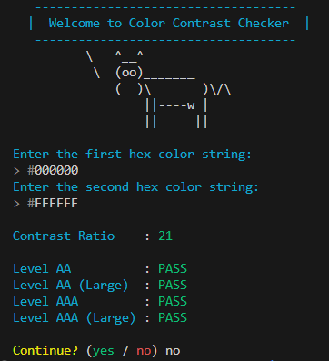

<div align="center">
  <h1 align="center">Ruby Color Contrast Checker</h1>
  <p align="center">CLI interface for checking WCAG2.0 Color Contrast Ratio in Ruby.</p>
</div>

<br />

<div align="center">
  <a href="https://badge.fury.io/rb/ruby_color_contrast_checker">
    
  </a>
  &nbsp;
  <a href="https://github.com/cheehwatang/ruby_color_contrast_checker/blob/main/LICENSE.txt">
    
  </a>
  &nbsp;
  <a href="#">
    
  </a>
  &nbsp;
  <a href="#">
    
  </a>
  &nbsp;
  <a href="#">
    
  </a>
  &nbsp;
  <a href="https://github.com/standardrb/standard">
    
  </a>
  &nbsp;
  <a href="#">
    
  </a>
</div>

<br />

<hr />

<br />

Check if the 2 colors provided pass the AA and AAA Levels (including for Large Text and Icons), according to [WCAG 2.1 guidelines](https://www.w3.org/WAI/WCAG21/Understanding/contrast-minimum.html).

Further information can be found [here](https://webaim.org/articles/contrast/).

In summary:

- Level AA : Ratio > 4.5
- Level AA (Large) : Ratio > 3.0
- Level AAA : Ratio > 7.0
- Level AAA (Large) : Ratio > 4.5

Note:

Large is for regular text with 18pt or larger, or bold text with 14pt or larger.

Logo generally fall into the large category.

It is recommended to fulfill at least Level AA for your projects.

<br />

## Installation

Install the gem:

```console
$ gem install ruby_color_contrast_checker
```

<br />

## Usage

Run the `contrast_checker` executable:

```shell
$ contrast_checker

       ------------------------------------
      |  Welcome to Color Contrast Checker  |
       ------------------------------------
                \   ^__^
                 \  (oo)_______
                    (__)\       )\/\
                        ||----w |
                        ||     ||

Enter the first hex color string:
> #000000
Enter the second hex color string:
> #FFFFFF

Contrast Ratio    : 21

Level AA          : PASS
Level AA (Large)  : PASS
Level AAA         : PASS
Level AAA (Large) : PASS
```



<br />

## Development

After checking out the repo, run `bin/setup` to install dependencies. Then, run `rake spec` to run the tests. You can also run `bin/console` for an interactive prompt that will allow you to experiment.

To install this gem onto your local machine, run `bundle exec rake install`.

<br />

## Contributing

Bug reports and pull requests are welcome on GitHub at https://github.com/cheehwatang/ruby_color_contrast_checker. This project is intended to be a safe, welcoming space for collaboration, and contributors are expected to adhere to the [code of conduct](https://github.com/cheehwatang/ruby_color_contrast_checker/blob/master/CODE_OF_CONDUCT.md).

<br />

## License

The gem is available as open source under the terms of the [MIT License](https://opensource.org/licenses/MIT).

<br />

## Code of Conduct

Everyone interacting in the Ruby Color Contrast Checker project's codebases, issue trackers, chat rooms and mailing lists is expected to follow the [code of conduct](https://github.com/cheehwatang/ruby_color_contrast_checker/blob/master/CODE_OF_CONDUCT.md).

<br />

## 🌟 Special Thanks

- [WebAIM Contrast Checker API](https://webaim.org/resources/contrastchecker/) for the contrast checker API.
- [Richard Bates](https://github.com/richo225) for the [blog post](https://richardbates.dev/blog/2023-05-05) on releasing a gem.
